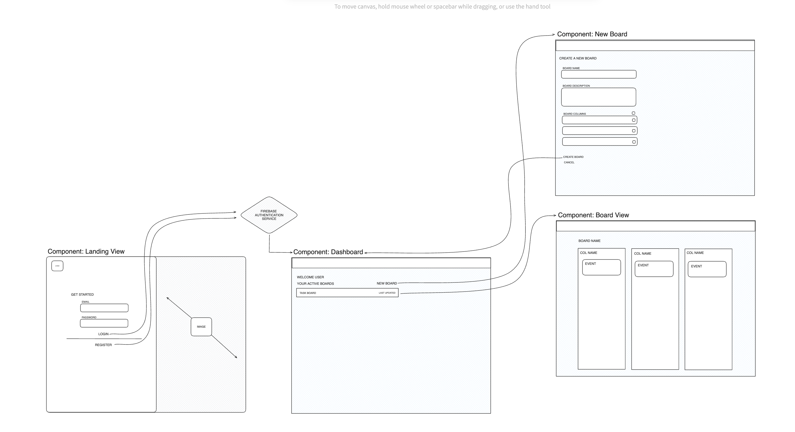

# V1.0 Design

## UI Flow Diagram
Below is a basic representation of the UI flow in the application. This shows how the navigation will work between all the different screens in the app.

## UI Screens

### Landing Screen:

The initial page that users encounter upon opening the app.
Features light marketing content along with a user-friendly login interface for both new registrations and existing users.

### Dashboard Screen:

The central hub of the app, presenting users with comprehensive information relevant to their account.
Enables users to effortlessly navigate through their associated boards and provides an option to create a new board seamlessly.

### New Board Screen:

A user-friendly form facilitating the creation of a new board.
Requests essential details such as Board Name, Description, and Board Columns.
Upon form submission, a new board is generated.

### Board Screen:

The primary view accessed when users click on a specific board.
Showcases a Kanban layout featuring multiple columns and events.
Kanban Events are customizable; users can drag and drop them between columns, edit their content, or archive them.
Users have the capability to initiate a new event for a column by clicking the "New Event" button located to the right of the column header.

### Add Event Screen:

A dedicated screen facilitating the addition of new events to a specific board.
Streamlines the process of inputting event details and associating them with the relevant columns.
User is requred to supply event name and description, Status is determined by the column name.

### Edit Event Screen:

A user-friendly interface that allows users to modify existing Kanban events.
Provides options for editing event details, relocating events between columns, and managing event status.

